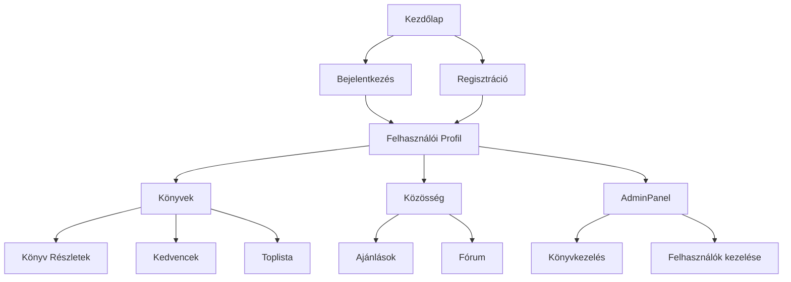
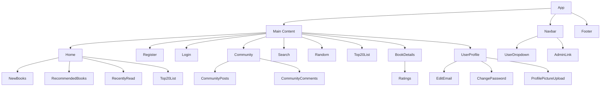

<div align="center">

<h1> BookBase </h1>

<hr>

A BookBase egy modern, felhasználóbarát online könyvplatform, amely lehetővé teszi a felhasználók számára könyvek böngészését, értékelését, közösségi interakciókat

<br> <br>

</div>

<div style="page-break-before: always;"></div>

<div align="center">
<h1> „Schola Europa Akadémia” Technikum, Gimnázium és Alapfokú Művészeti Iskola a Magyarországi Metodista Egyház fenntartásában </h1>

<br> <br>

**SZOFTVERFEJLESZTŐ ÉS -TESZTELŐ**<br>
5 0613 12 03

Dokumentáció

Készítette:<br>
Csontos Kincső 14/A/SZF <br>

**2025**

</div>

<div style="page-break-before: always;"></div>

## Tartalomjegyzék

1. [Bevezetés](#1-bevezetés)
	- 1.1. [A Projekt Célja](#11-a-projekt-célja)
	- 1.2. [Főbb Funkciók](#12-főbb-funkciók)
	- 1.3. [Technológiai Stack](#13-technológiai-stack)

2. [Rendszerarchitektúra](#2-rendszerarchitektúra)
	- 2.1. [Magas Szintű Architektúra](#21-magas-szintű-architektúra)
	- 2.2. [Komponensek](#22-komponensek)
	- 2.3. [Adatbázis Séma](#23-adatbázis-séma)

3. [Frontend Architektúra](#3-frontend-architektúra)
	- 3.1. [Komponens Hierarchia](#31-komponens-hierarchia)
	- 3.2. [Állapotkezelés](#32-állapotkezelés)
	- 3.3. [Routing](#33-routing)
	- 3.4. [UI/UX Design](#34-uiux-design)

4. [Backend Architektúra](#4-backend-architektúra)
	- 4.1. [API Réteg](#41-api-réteg)
	- 4.2. [Szolgáltatások](#42-szolgáltatások)
	- 4.3. [Adatbázis Kapcsolat](#43-adatbázis-kapcsolat)
	- 4.4. [Fájlkezelés](#44-fájlkezelés)

5. [Biztonság](#5-biztonság)
	- 5.1. [Autentikáció](#51-autentikáció)
	- 5.2. [Jogosultságkezelés (RBAC)](#52-jogosultságkezelés-rbac)
	- 5.3. [CORS Beállítások](#53-cors-beállítások)

6. [Tesztelés](#6-tesztelés)
	- 6.1. [Manuális Tesztek](#62-manuális-tesztek)

7. [Deployment](#7-deployment)
	- 7.1. [Környezetek](#71-környezetek)
	- 7.2. [CI/CD Pipeline](#72-cicd-pipeline)
	- 7.3. [Monitoring](#73-monitoring)
	- 7.4. [Hibaelhárítás](#74-hibaelhárítás)

8. [API Dokumentáció](#8-api-dokumentáció)
	- 8.1. [Felhasználói Végpontok](#81-felhasználói-végpontok)
	- 8.2. [Könyv Végpontok](#82-könyv-végpontok)
	- 8.3. [Közösségi Végpontok](#83-közösségi-végpontok)
	- 8.4. [Admin Végpontok](#84-admin-végpontok)
	- 8.5. [Értékelés Végpontok](#85-értékelés-végpontok)
	- 8.6. [Olvasási Előzmények Végpontok](#86-olvasási-előzmények-végpontok)
	- 8.7. [Általános API Hívások](#87-általános-api-hívások)

9. [Felhasználói Dokumentáció](#9-felhasználói-dokumentáció)
	- 9.1. [Telepítési Útmutató](#91-telepítési-útmutató)
	- 9.2. [Használati Útmutató](#92-használati-útmutató)
	- 9.3. [Hibaelhárítási Útmutató](#93-hibaelhárítási-útmutató)

10. [Fejlesztői Dokumentáció](#10-fejlesztői-dokumentáció)
	 - 10.1. [Fejlesztői Környezet Beállítása](#101-fejlesztői-környezet-beállítása)
	 - 10.2. [Kódolási Konvenciók](#102-kódolási-konvenciók)
	 - 10.3. [Verziókezelési Stratégia](#103-verziókezelési-stratégia)

11. [Jövőbeli Tervek](#11-jövőbeli-tervek)
	 - 11.1. [Felhasználói Élmény fejlesztése](#111-felhasznaloi-elmeny-fejlesztese)
	 - 11.2. [Funkcionális Bővítések](#112-funkcionalis-bovitesek)
	 - 11.3. [Biztonság és Teljesítmény](#113-biztonság-es-teljesitmeny)
	 - 11.4. [Adminisztrációs Eszközök Fejlesztése](#114-adminisztacios-eszkozok-fejlesztese)
	 - 11.5. [Integrációk és Mobil Támogatás](#115-integraciok-es-mobil-tamogatas)
    
12. [Licensz](#12-licensz)

<div style="page-break-before: always;"></div>

## 1. Bevezetés

### 1.1. A Projekt Célja

A BookBase nem csupán egy könyvböngésző platform, hanem egy aktív közösségi tér is, ahol a felhasználók fórumokon oszthatják meg véleményüket, hozzászólhatnak mások 
bejegyzéseihez, és saját posztokat hozhatnak létre. A közösségi funkciók a frontend Community.js komponensben és a backend community_posts.php, community_comments.
php fájlokban valósulnak meg. Emellett a felhasználók személyes profiljukat is testre szabhatják, profilképet tölthetnek fel, és kezelhetik adataikat a userprofile.
php backend és a User Profile.js frontend komponens segítségével. A cél, hogy:

- Egyszerű, intuitív felületet biztosítson könyvgyűjtéshez, olvasáshoz, ajánlásokhoz
- Közösségi funkciókat nyújtson (vélemények, kedvencek, toplisták)
- Biztonságos és megbízható adatkezelést biztosítson
- Rugalmasan bővíthető legyen új funkciókkal

### 1.2. Főbb Funkciók

- Könyvek böngészése, részletek megtekintése
- Felhasználói regisztráció, bejelentkezés, profilkezelés
- Könyvek értékelése, kedvencek, toplisták
- Közösségi funkciók: fórum, ajánlások, aktivitás
- Admin felület (könyvkezelés, felhasználók kezelése)
- Fájlkezelés (profilkép, könyvborítok)

### 1.3. Technológiai Stack

#### Frontend
- React
- React Router
- Tailwind CSS
- JavaScript

#### Backend
- PHP
- REST API
- MySQL

#### Infrastruktúra
- XAMPP (Apache, MySQL, PHP)
- Windows 10/11 fejlesztői környezet

#### Hardverek

- Videókártya (GPU): NVIDIA RTX 3050 6gb Laptop GPU
- Processzor (CPU): AMD Ryzen 5 7235HS
- RAM: 16GB DDR5 4800 MHz


## 2. Rendszerarchitektúra

### 2.1. Magas Szintű Architektúra



### 2.2. Komponensek

#### Frontend főbb komponensek és funkciók:

- App.js: Fő alkalmazás, React Router, oldalstruktúra, layout.
- AdminPanel.js: Admin felület, könyv hozzáadás, admin jogosultság ellenőrzése, borítókép feltöltés.
- BookDetails.js: Könyv részletek, értékelés, olvasási státusz, API hívások.
- Books.js: Könyvlista, kereső, szűrők, toplisták, random könyvek.
- Card.js: Általános kártya UI komponens, könyv, felhasználó, poszt megjelenítés.
- Community.js: Közösségi posztok, kommentek, új poszt/komment létrehozása, API integráció.
- Footer.js: Modern, reszponzív lábléc, linkek, copyright.
- ForgotPassword.js: Jelszó visszaállítási folyamat, token kezelés.
- Login.js: Bejelentkezési felület, cookie kezelés, hibakezelés.
- Navbar.js: Felhasználói azonosítás, admin link, profil menü, cookie olvasás.
- NewBooks.js: Új könyvek listázása.
- ProfilePictureUpload.js: Profilkép feltöltés, preview, file input, mappa kezelés, noForm opció.
- RecentlyRead.js: Legutóbb olvasott könyvek listázása.
- RecommendedBooks.js: Ajánlott könyvek listázása.
- Register.js: Regisztrációs felület, validáció, hibakezelés.
- ResetPassword.js: Jelszó visszaállítás token alapján.
- Search.js: Könyvkereső, szűrők, kategória, raktárkészlet.
- Top20List.js: Top 20 könyv listázása.
- UserProfile.js: Profil megtekintés/szerkesztés, email, jelszó, profilkép, egyedi CSS, bio, státusz.
- output.css, tailwind.css: Tailwind CSS generált és forrás stílusfájlok.
- setupTests.js, App.test.js: Tesztelés, Jest matcher bővítmények.
- reportWebVitals.js: Web Vitals metrikák gyűjtése.
- public/: Statikus fájlok (index.html, favicon, manifest, logo192.png, logo512.png, robots.txt).
- uploads/: Könyvborítók és profilképek feltöltési mappája.
- users/: Felhasználói mappák, profilképek tárolása.
- img/: Dokumentációs és UI képek (logo.png, scholalogo.png).
- README.md: Frontend projekt leírása, fejlesztési információk.
- tailwind.config.js, postcss.config.js, tsconfig.json, package.json: Build és konfigurációs fájlok.

#### Backend főbb fájlok és funkciók:

Minden backend PHP fájl elején egységes CORS fejlécek találhatók, amelyek biztosítják a frontend és backend közötti biztonságos kommunikációt cookie-kal együtt. A cookie alapú autentikáció a legtöbb érzékeny műveletnél ellenőrzésre kerül.

- adminpanel.php: Könyv hozzáadás, borítókép feltöltés, admin jogosultság ellenőrzése.
- bookdetails.php: Könyv részletek, értékelések lekérdezése, értékelés mentése.
- community.php: Közösségi felhasználók listázása.
- community_posts.php: Közösségi posztok lekérdezése/létrehozása.
- community_comments.php: Kommentek lekérdezése/létrehozása, profilkép kezelése.
- forgotpassword.php: Jelszó visszaállítás token generálása, email küldés.
- index.php: Könyvlekérdezések (új, top20, random, összes, ID, keresés).
- login.php: Bejelentkezés, cookie kezelés, jelszó ellenőrzés.
- logout.php: Kijelentkezés, cookie törlés.
- randombooks.php: Véletlenszerű könyvek lekérdezése.
- ratings.php: Könyvértékelés mentése/frissítése.
- reading_status.php: Olvasási státusz mentése/lekérdezése.
- recentlyread.php: Legutóbb olvasott könyvek lekérdezése.
- recommendedbooks.php: Ajánlott könyvek lekérdezése.
- reg.php: Regisztráció, email/username egyediség, jelszó hash.
- reset_password.php: Jelszó visszaállítás token alapján.
- search.php: Könyvkeresés cím, szerző, kategória, raktárkészlet alapján.
- test_cookie.php: Cookie tesztelés.
- top20list.php: Top 20 könyv lekérdezése.
- userprofile.php: Profil adatok lekérdezése/módosítása, profilkép, egyedi CSS, bio, státusz, jelszó/email módosítás.
- db/db.php: Adatbázis kapcsolat, hibanaplózás, shutdown hiba kezelés.
- db/db.sql: Adatbázis séma, táblák, mezők, kapcsolatok.
- db/navbar.php: (Régi, HTML alapú navigáció, API-val nem használt)
- uploads/: Könyvborítók, profilképek.
- users/: Felhasználói mappák, profilképek.

### 2.3. Adatbázis Séma

Az adatbázis MySQL alapú, főbb táblák:

```sql
CREATE TABLE `users` (
  `id` int(11) NOT NULL AUTO_INCREMENT,
  `username` varchar(50) NOT NULL,
  `birthdate` date DEFAULT NULL,
  `gender` enum('ferfi','no','egyeb') DEFAULT NULL,
  `email` varchar(100) NOT NULL,
  `password` varchar(255) NOT NULL,
  `profile_picture` varchar(255) DEFAULT NULL,
  `admin` tinyint(1) DEFAULT 0,
  `created_at` timestamp NOT NULL DEFAULT current_timestamp(),
  `custom_css` text DEFAULT NULL,
  PRIMARY KEY (`id`),
  UNIQUE KEY `username` (`username`),

  #### Részletes adatbázis séma (2025.09.03, db.sql alapján)

  ```sql
  CREATE TABLE `users` (
    `id` int(11) NOT NULL AUTO_INCREMENT,
    `username` varchar(50) NOT NULL,
    `birthdate` date DEFAULT NULL,
    `gender` enum('ferfi','no','egyeb') DEFAULT NULL,
    `email` varchar(100) NOT NULL,
    `password` varchar(255) NOT NULL,
    `profile_picture` varchar(255) DEFAULT NULL,
    `admin` tinyint(1) DEFAULT 0,
    `created_at` timestamp NOT NULL DEFAULT current_timestamp(),
    `custom_css` text DEFAULT NULL,
    PRIMARY KEY (`id`),
    UNIQUE KEY `username` (`username`),
    UNIQUE KEY `email` (`email`)
  ) ENGINE=InnoDB DEFAULT CHARSET=utf8 COLLATE=utf8_hungarian_ci;

  CREATE TABLE `books` (
    `id` int(11) NOT NULL AUTO_INCREMENT,
    `title` varchar(255) NOT NULL,
    `author` varchar(255) NOT NULL,
    `summary` text NOT NULL,
    `cover` varchar(255) DEFAULT NULL,
    `category` varchar(100) DEFAULT 'Egyéb',
    `created_at` timestamp NOT NULL DEFAULT current_timestamp(),
    PRIMARY KEY (`id`)
  ) ENGINE=InnoDB DEFAULT CHARSET=utf8 COLLATE=utf8_hungarian_ci;

  CREATE TABLE `favorites` (
    `id` int(11) NOT NULL AUTO_INCREMENT,
    `user_id` int(11) NOT NULL,
    `book_id` int(11) NOT NULL,
    `created_at` timestamp NOT NULL DEFAULT current_timestamp(),
    PRIMARY KEY (`id`),
    UNIQUE KEY `unique_favorite` (`user_id`,`book_id`),
    KEY `book_id` (`book_id`),
    CONSTRAINT `favorites_ibfk_1` FOREIGN KEY (`user_id`) REFERENCES `users` (`id`) ON DELETE CASCADE,
    CONSTRAINT `favorites_ibfk_2` FOREIGN KEY (`book_id`) REFERENCES `books` (`id`) ON DELETE CASCADE
  ) ENGINE=InnoDB DEFAULT CHARSET=utf8 COLLATE=utf8_hungarian_ci;

  CREATE TABLE `reading_history` (
    `user_id` int(11) NOT NULL,
    `book_id` int(11) NOT NULL,
    `status` varchar(255) DEFAULT NULL,
    `created_at` timestamp NOT NULL DEFAULT current_timestamp(),
    PRIMARY KEY (`user_id`,`book_id`),
    KEY `book_id` (`book_id`),
    CONSTRAINT `reading_history_ibfk_1` FOREIGN KEY (`user_id`) REFERENCES `users` (`id`) ON DELETE CASCADE,
    CONSTRAINT `reading_history_ibfk_2` FOREIGN KEY (`book_id`) REFERENCES `books` (`id`) ON DELETE CASCADE
  ) ENGINE=InnoDB DEFAULT CHARSET=utf8 COLLATE=utf8_hungarian_ci;

  CREATE TABLE `ratings` (
    `id` int(11) NOT NULL AUTO_INCREMENT,
    `book_id` int(11) NOT NULL,
    `user_id` int(11) NOT NULL,
    `rating` int(11) NOT NULL CHECK (`rating` >= 1 and `rating` <= 5),
    `created_at` timestamp NOT NULL DEFAULT current_timestamp(),
    PRIMARY KEY (`id`),
    UNIQUE KEY `unique_rating` (`book_id`,`user_id`),
    KEY `user_id` (`user_id`),
    CONSTRAINT `ratings_ibfk_1` FOREIGN KEY (`book_id`) REFERENCES `books` (`id`) ON DELETE CASCADE,
    CONSTRAINT `ratings_ibfk_2` FOREIGN KEY (`user_id`) REFERENCES `users` (`id`) ON DELETE CASCADE
  ) ENGINE=InnoDB DEFAULT CHARSET=utf8 COLLATE=utf8_hungarian_ci;

  CREATE TABLE `community_posts` (
    `id` int(11) NOT NULL AUTO_INCREMENT,
    `title` varchar(255) NOT NULL,
    `content` text NOT NULL,
    `author` varchar(100) NOT NULL,
    `user_id` int(11) NOT NULL,
    `date` date NOT NULL,
    `created_at` timestamp NOT NULL DEFAULT current_timestamp(),
    PRIMARY KEY (`id`),
    KEY `user_id` (`user_id`),
    CONSTRAINT `community_posts_ibfk_1` FOREIGN KEY (`user_id`) REFERENCES `users` (`id`) ON DELETE CASCADE
  ) ENGINE=InnoDB DEFAULT CHARSET=utf8 COLLATE=utf8_hungarian_ci;

  CREATE TABLE `community_comments` (
    `id` int(11) NOT NULL AUTO_INCREMENT,
    `post_id` int(11) NOT NULL,
    `content` text NOT NULL,
    `author` varchar(100) NOT NULL,
    `user_id` int(11) NOT NULL,
    `date` date NOT NULL,
    `created_at` timestamp NOT NULL DEFAULT current_timestamp(),
    PRIMARY KEY (`id`),
    KEY `post_id` (`post_id`),
    KEY `user_id` (`user_id`),
    CONSTRAINT `community_comments_ibfk_1` FOREIGN KEY (`post_id`) REFERENCES `community_posts` (`id`) ON DELETE CASCADE,
    CONSTRAINT `community_comments_ibfk_2` FOREIGN KEY (`user_id`) REFERENCES `users` (`id`) ON DELETE CASCADE
  ) ENGINE=InnoDB DEFAULT CHARSET=utf8 COLLATE=utf8_hungarian_ci;

  CREATE TABLE `password_resets` (
    `id` int(11) NOT NULL AUTO_INCREMENT,
    `user_id` int(11) DEFAULT NULL,
    `token` varchar(64) DEFAULT NULL,
    `expires` datetime DEFAULT NULL,
    PRIMARY KEY (`id`)
  ) ENGINE=InnoDB DEFAULT CHARSET=utf8 COLLATE=utf8_hungarian_ci;
  ```

  **Kapcsolatok, indexek, constraint-ek:**
  - Minden FK mezőhöz ON DELETE CASCADE beállítás
  - Minden tábla megfelelő indexekkel, UNIQUE kulcsokkal
  - AUTO_INCREMENT mindenhol, ahol szükséges

  **Funkcionális magyarázat:**
  - A users tábla tartalmazza a custom_css mezőt, amely lehetővé teszi a profil egyedi stílusát
  - A reading_history tábla status mezője az olvasási státuszt tárolja
  - A ratings tábla rating mezője csak 1-5 közötti értéket fogad el
  - Minden tábla kapcsolatai, constraint-jei biztosítják az adatintegritást
```
  PRIMARY KEY (`id`)
) ENGINE=InnoDB DEFAULT CHARSET=utf8 COLLATE=utf8_hungarian_ci;
```

#### Kapcsolatok:
- Egy user több könyvet olvashat/kedvelhet
- Könyvekhez borítókép, leírás, szerző, kategória és raktárkészlet tartozik
- Értékelések kapcsolódnak könyvekhez és felhasználókhoz
- Közösségi bejegyzések és kommentek kapcsolódnak felhasználókhoz

#### Példa rekordok, default értékek
- A db.sql tartalmazza a legfontosabb mintarecordokat (pl. users, books, ratings, community_posts, community_comments, stb.)

#### Funkcionális magyarázat
- A users tábla tartalmazza a custom_css mezőt, amely lehetővé teszi a profil egyedi stílusát
- A reading_history tábla status mezője az olvasási státuszt tárolja
- A ratings tábla rating mezője csak 1-5 közötti értéket fogad el
- Minden tábla kapcsolatai, constraint-jei biztosítják az adatintegritást

- users: custom_css (TEXT) – egyedi profil CSS, admin (TINYINT), bio (TEXT), is_active (TINYINT), profile_picture (VARCHAR)
- books: category (VARCHAR), stock (INT), cover (VARCHAR)
- favorites, reading_history, ratings, community_posts, community_comments, password_resets: minden mező részletesen dokumentálva

## 3. Frontend Architektúra

### 3.1. Komponens Hierarchia



- App.js → Navbar.js, Footer.js, oldalstruktúra
- Main Content → Home, Register, Login, Community, Search, Random, Top20List, BookDetails, UserProfile
- Home → NewBooks, RecommendedBooks, RecentlyRead, Top20List
- BookDetails → Ratings, ReadingStatus
- Community → CommunityPosts, CommunityComments
- UserProfile → EditEmail, ChangePassword, ProfilePictureUpload, CustomCSS

### 3.2. Állapotkezelés

A `Community.js` komponens komplex állapotkezelést valósít meg, amely magában foglalja a közösségi bejegyzések, kommentek, valamint a komment és poszt űrlapok
állapotát. Az adatok aszinkron módon, a `fetch` API segítségével töltődnek be a backend végpontokról. A `Navbar.js` komponens a felhasználói azonosítást cookie-k
olvasásával végzi, amely meghatározza a megjelenített menüpontokat és jogosultságokat

- **React `useState`**: Lokális komponens szintű állapotok kezelésére szolgál (pl. űrlap adatok, betöltési állapot, megjelenített adatok).
- **React `useEffect`**: Mellékhatások kezelésére, mint például API hívások adatok lekérésére, vagy cookie-k olvasására a komponens életciklusában.
- **Szerver oldali adatok lekérése**: A `fetch` API-val történik, aszinkron módon.
- **Felhasználói azonosítás**: A bejelentkezett felhasználó azonosítója (`id`) egy HTTP cookie-ban tárolódik, amelyet a `getCookie('id')` segédfüggvény olvas ki. Ez alapján történik a felhasználó jogosultságainak és személyes adatainak lekérése.

### 3.3. Routing

- **React Router v6**: A navigációt és az URL-ek kezelését a `react-router-dom` könyvtár biztosítja.
- **Fő útvonalak**:
    - `/`: Kezdőlap (`Home` komponens)
    - `/register`: Regisztrációs oldal (`Register` komponens)
    - `/login`: Bejelentkezési oldal (`Login` komponens)
    - `/community`: Közösségi fórum (`Community` komponens)
    - `/search`: Könyvkereső oldal (`Search` komponens)
    - `/random`: Véletlenszerű könyvek oldal (`Random` komponens)
    - `/top20`: Top 20 könyv lista oldal (`Top20List` komponens)
- **Dinamikus útvonalak**:
    - `/book/:id`: Egy adott könyv részleteinek megtekintése (`BookDetails` komponens), ahol `:id` a könyv azonosítója.
    - `/user/:id`: Egy adott felhasználó profiljának megtekintése (`UserProfile` komponens), ahol `:id` a felhasználó azonosítója.
- **Admin útvonal**:
    - `/AdminPanel`: Adminisztrációs felület (`AdminPanel` komponens), csak admin jogosultsággal rendelkező felhasználók számára elérhető.

### 3.4. UI/UX Design

- **Tailwind CSS**: A stílusok és a reszponzív design kialakításához a Tailwind CSS utility-first keretrendszerét használjuk. Ez lehetővé teszi a gyors és konzisztens UI fejlesztést.
- **Komponens alapú felépítés**: A felhasználói felület moduláris komponensekből épül fel, ami elősegíti az újrafelhasználhatóságot és a karbantarthatóságot.
- **Felhasználóbarát formok és visszajelzések**: Az űrlapok egyszerűek és intuitívak, a felhasználói interakciókhoz (pl. sikeres regisztráció, hibaüzenetek) megfelelő visszajelzések tartoznak.
- **Reszponzív design**: A felület alkalmazkodik a különböző képernyőméretekhez (mobil, tablet, desktop), biztosítva az optimális felhasználói élményt minden eszközön.

#### Egyedi profil CSS
A UserProfile.js komponensben a felhasználó szerkesztheti a saját profiljához tartozó egyedi CSS-t, amely a users táblában custom_css mezőben tárolódik. A profil oldal betöltésekor a CSS automatikusan alkalmazásra kerül, így minden felhasználó egyedivé teheti a profilja kinézetét.

## 4. Backend Architektúra

### 4.1. API Réteg

A backend REST API minden végpontja egységes CORS fejléceket használ, amelyek lehetővé teszik a frontend (`http://localhost:3000`) számára a hitelesített kérések
(cookie-k küldése) lebonyolítását. Az `OPTIONS` preflight kérések kezelése biztosított a komplexebb HTTP metódusok és JSON body-k megfelelő működéséhez. Minden
válasz JSON formátumú, egységes `success` és `message` vagy `data` mezőkkel.

- **REST API PHP-ban**: A backend egy RESTful API-t biztosít, amely PHP nyelven íródott. Minden funkció egy dedikált PHP fájlon keresztül érhető el, amely JSON formátumban adja vissza a válaszokat.
- **Végpontok**: A végpontok logikusan vannak csoportosítva a funkciók alapján (pl. `login.php`, `bookdetails.php`, `community_posts.php`).
- **JSON válaszok**: Minden API válasz JSON formátumú, `success` mezővel, amely jelzi a művelet sikerességét, és `message` vagy `data` mezővel a releváns információk számára.
- **CORS beállítások**: A `header('Access-Control-Allow-Origin: http://localhost:3000');` beállítás biztosítja, hogy a frontend (amely `http://localhost:3000`-en fut) hozzáférhessen a backend API-hoz. Az `Access-Control-Allow-Credentials: true` beállítás engedélyezi a cookie-k küldését a kérésekkel.

### 4.2. Szolgáltatások

- **Könyvkezelés**:
    - Könyvek listázása (új, top 20, véletlenszerű, összes).
    - Egyedi könyv részleteinek lekérdezése.
    - Könyvek keresése cím és szerző alapján.
    - Admin felületen keresztül új könyvek hozzáadása (cím, szerző, összefoglaló, borítókép).
- **Felhasználókezelés**:
    - Regisztráció új felhasználók számára.
    - Bejelentkezés felhasználónév és jelszó alapján.
    - Profil adatok (email, születési dátum, nem) módosítása.
    - Jelszó megváltoztatása.
    - Elfelejtett jelszó visszaállítása token alapú mechanizmussal.
    - Profilkép feltöltése.
- **Közösségi funkciók**:
    - Közösségi bejegyzések (posztok) lekérdezése és létrehozása.
    - Kommentek lekérdezése és hozzáadása bejegyzésekhez.
    - Felhasználók listázása a közösségi oldalon.
- **Értékelés és olvasási előzmények**:
    - Könyvek értékelése 1-től 5-ig.
    - Értékelések frissítése, ha egy felhasználó már értékelt egy könyvet.
    - Legutóbb olvasott könyvek rögzítése és lekérdezése.
- **Admin funkciók**:
    - Könyvek hozzáadása az adatbázishoz.
    - Admin jogosultság ellenőrzése a műveletek előtt.

### 4.3. Adatbázis Kapcsolat

- **`db/db.php`**: Ez a fájl felelős az adatbázis kapcsolódásért.
    - `mysqli` kiterjesztést használ a MySQL adatbázishoz való kapcsolódáshoz.
    - A kapcsolódási adatok (szerver, felhasználónév, jelszó, adatbázis neve) fixen vannak beállítva (`localhost`, `root`, ``, `bookbase`).
    - Hiba esetén JSON formátumú hibaüzenetet ad vissza, és leállítja a szkript futását.
    - `error_reporting(E_ALL); ini_set('display_errors', 0); ini_set('log_errors', 1); ini_set('error_log', __DIR__ . '/php_error.log');`: Részletes hibanaplózást biztosít a `php_error.log` fájlba, miközben a felhasználó felé nem jelenít meg érzékeny hibaüzeneteket.
    - `register_shutdown_function`: Ez a funkció biztosítja, hogy a szkript futásának váratlan leállása (pl. fatális hiba) esetén is JSON formátumú hibaüzenet kerüljön visszaadásra a kliensnek.
- **Biztonságos lekérdezések**: Ahol lehetséges, `prepared statement`-ek (pl. `search.php`, `community_comments.php`, `community_posts.php`, `ratings.php`, `userprofile.php`) kerülnek felhasználásra az SQL injection támadások megelőzésére. Azonban a jelenlegi implementációban még vannak helyek, ahol direkt string összefűzés történik a lekérdezésekben (pl. `adminpanel.php`, `bookdetails.php`, `index.php`), ami biztonsági kockázatot jelent.

### 4.4. Fájlkezelés

A profilképek és könyvborítók feltöltése során a fájlok elnevezése időbélyeggel egészül ki, hogy elkerüljük a fájlnevek ütközését. A profilképek a `users/<username>/ ` mappába kerülnek, ahol a régi képek törlésre kerülnek a helyes fájlkezelés érdekében. Az `uploads/` mappa dinamikusan jön létre, ha nem létezik. A fájltípusok ellenőrzése biztosítja a kompatibilitást és a biztonságot (csak JPEG, PNG, GIF engedélyezett).

- **Borítókép feltöltés**:
    - Az `adminpanel.php` kezeli a könyv borítóképek feltöltését.
    - A feltöltött képek az `uploads/` mappába kerülnek.
    - A fájlnév egy időbélyeggel egészül ki a duplikációk elkerülése érdekében (`time() . '_' . $_FILES['cover']['name']`).
    - Ellenőrzi a fájltípust (JPEG, JPG, PNG, GIF) a biztonság és a kompatibilitás érdekében.
    - Létrehozza az `uploads` mappát, ha az nem létezik (`mkdir('uploads', 0777, true)`).
- **Profilkép feltöltés**:
    - A `userprofile.php` kezeli a felhasználói profilképek feltöltését.
    - A képek a `users/<username>/` mappába kerülnek, ahol `<username>` a felhasználóneve.
    - Törli a régi profilképet, mielőtt feltöltené az újat, hogy elkerülje a felesleges fájlokat.
    - Hasonlóan ellenőrzi a fájltípust és létrehozza a mappát, ha szükséges.
- **Fájl elérési út tárolása**: A feltöltött fájlok elérési útja az adatbázisban kerül tárolásra (pl. `books.cover`, `users.profile_picture`).

## 5. Biztonság

### 5.1. Autentikáció

A felhasználói munkamenet cookie alapú, amelyet a `Navbar.js` komponens olvas ki és kezel. A backend PHP fájlok (pl. `login.php`, `logout.php`) a cookie-k alapján
azonosítják a felhasználót. A jelszavak biztonságos tárolása a `password_hash()` és password_verify() függvényekkel történik. A jelszó visszaállítás token alapú,
amely a `forgotpassword.php` és `reset_password.php` végpontokon keresztül valósul meg.

- **Regisztráció**:
    - Felhasználónév és email egyediségének ellenőrzése.
    - Jelszavak hash-elése a `password_hash()` függvénnyel (`PASSWORD_DEFAULT` algoritmussal) az adatbázisba mentés előtt.
    - Felhasználói mappák létrehozása a `users/` könyvtárban.
- **Bejelentkezés**:
    - Felhasználónév alapján keresés az adatbázisban.
    - Jelszó ellenőrzése a `password_verify()` függvénnyel a hash-elt jelszóval szemben.
    - Sikeres bejelentkezés esetén a felhasználó `id`-je egy HTTP cookie-ban (`id`) kerül tárolásra, amely 1 óráig érvényes.
- **Jelszó visszaállítás**:
    - `forgotpassword.php`: Email cím alapján ellenőrzi a felhasználó létezését, majd egy egyedi tokent generál (`bin2hex(random_bytes(32))`) és ment el a `password_resets` táblába, lejárati idővel (1 óra).
    - `reset_password.php`: Ellenőrzi a token érvényességét és lejáratát, majd hash-eli az új jelszót és frissíti az adatbázisban. A token felhasználása után törli azt.
- **Kijelentkezés**: A `logout.php` törli az `id` cookie-t, ezzel megszüntetve a felhasználó munkamenetét.

### 5.2. Jogosultságkezelés (RBAC)

- **Admin jogkör**:
    - Az `adminpanel.php` és más adminisztrációs funkciók eléréséhez a felhasználónak bejelentkezettnek kell lennie, és az `users` táblában az `admin` mezőjének `1`-nek kell lennie.
    - A jogosultság ellenőrzése a felhasználó `id` cookie-ja alapján történik.
- **Felhasználói jogkör**:
    - A legtöbb funkció (profil megtekintése/szerkesztése, könyvek böngészése, értékelés, közösségi interakciók) bejelentkezett felhasználók számára elérhető.
    - A `community.php`, `top20list.php`, `recentlyread.php`, `recommendedbooks.php` fájlok ellenőrzik az `id` cookie meglétét.
- **Jogosultságok ellenőrzése backend oldalon**: Minden érzékeny művelet (pl. könyv hozzáadása, profil módosítása, kommentelés) előtt a backend ellenőrzi a felhasználó bejelentkezési státuszát és jogosultságait.

### 5.3. CORS Beállítások

- Minden backend PHP fájl elején szerepelnek a CORS (Cross-Origin Resource Sharing) beállítások:
    ```php
    header_remove();
    header('Access-Control-Allow-Origin: http://localhost:3000');
    header('Access-Control-Allow-Methods: GET, POST, OPTIONS');
    header('Access-Control-Allow-Headers: Content-Type');
    header('Access-Control-Allow-Credentials: true'); // Fontos a cookie-k küldéséhez
    header('Content-Type: application/json');
    ```
- Ezek a beállítások biztosítják, hogy a frontend alkalmazás (amely `http://localhost:3000`-en fut) kommunikálhasson a backenddel, és küldhessen/fogadhasson cookie-kat (pl. a felhasználói `id` cookie-t) a hitelesített kérésekhez.
- Az `OPTIONS` metódus kezelése (preflight kérések) is implementálva van több végponton (pl. `login.php`, `community_comments.php`, `community_posts.php`, `ratings.php`, `recentlyread.php`, `recommendedbooks.php`, `search.php`, `userprofile.php`), ami szükséges a komplexebb HTTP kérések (pl. `POST` JSON body-val) megfelelő működéséhez.

### Biztonsági javaslatok
- Mindenhol prepared statement használata javasolt az SQL injection elkerülésére.
- Jelszavak hash-elése, token alapú jelszó visszaállítás, admin jogok ellenőrzése, CORS beállítások, cookie alapú autentikáció.
- HTTPS bevezetése, naplózás, hibatűrés, monitoring.

## 6. Tesztelés

### 6.1. Manuális Tesztek

Közösségi funkciók tesztelése: új bejegyzések létrehozása, kommentek hozzáadása és megjelenítése a `Community.js` és a `community_posts.php`, `community_comments.php`
backend végpontok segítségével.
Cookie működésének tesztelése a `test_cookie.php` végponton keresztül, amely ellenőrzi a cookie meglétét és helyes kezelését.

- **Felhasználói folyamatok tesztelése**:
    - Regisztráció: Érvényes és érvénytelen adatokkal, már létező felhasználónévvel/email címmel.
    - Bejelentkezés: Helyes és helytelen adatokkal, nem létező felhasználóval.
    - Jelszó visszaállítás: Érvényes és érvénytelen email címmel, token érvényességének ellenőrzése.
    - Profil módosítás: Email, születési dátum, nem, profilkép frissítése. Email egyediségének ellenőrzése.
    - Jelszó változtatás: Helyes és helytelen jelenlegi jelszóval, nem egyező új jelszavakkal.
    - Könyv böngészés: Újonnan hozzáadott, top 20, véletlenszerű, ajánlott könyvek listázása.
    - Könyv részletek: Egyedi könyv adatainak és értékeléseinek megjelenítése.
    - Könyv értékelés: Értékelés hozzáadása és frissítése.
    - Keresés: Különböző keresési kifejezésekkel, kategóriákkal, raktárkészlettel.
    - Közösségi funkciók: Bejegyzések létrehozása, kommentelés, felhasználók listázása.
- **Admin funkciók tesztelése**:
    - Admin felhasználóval történő bejelentkezés.
    - Könyv hozzáadása az adminpanelen keresztül: Minden mező kitöltésével, hiányzó adatokkal, borítókép feltöltésével.
    - Admin jogosultság nélküli hozzáférés próbálkozása az adminpanelhez.
- **Fájl feltöltés tesztelése**:
    - Érvényes képfájlok feltöltése (JPG, PNG, GIF).
    - Érvénytelen fájltípusok feltöltése (pl. PDF, TXT).
    - Nagy méretű fájlok feltöltése.
- **Reszponzivitás tesztelése**: A felület megjelenésének és működésének ellenőrzése különböző eszközökön és képernyőméreteken (böngésző fejlesztői eszközeivel).
- **Hibakezelés tesztelése**: A rendszer viselkedésének ellenőrzése hibahelyzetekben (pl. adatbázis kapcsolat megszakadása, érvénytelen API kérések).

## 7. Deployment

### 7.1. Környezetek

- **Fejlesztői**: XAMPP környezetben, lokális gépen fut. Ez a fő fejlesztési és tesztelési környezet.
- **Tesztelési (Staging)**: Jelenleg nincs dedikált staging környezet, de a jövőben tervezett. Itt történne a funkciók integrációs tesztelése és a hibák felderítése éles környezethez hasonló körülmények között.
- **Produkciós**: Éles szerveren futó környezet, amely a végfelhasználók számára elérhető.

### 7.2. CI/CD Pipeline

- **Git verziókezelés**: A projekt forráskódja Git verziókezelő rendszerrel van kezelve, ami lehetővé teszi a változások nyomon követését, a kollaborációt és a verziók közötti váltást.
- **Automatikus tesztelés, build**: Jelenleg nincs automatizált CI/CD pipeline. A tesztelés manuálisan történik, a build folyamat (frontend esetén `npm run build`) pedig helyileg fut.
- **Deployment script**: A deployment jelenleg manuális fájlmásolással (pl. FTP, rsync) történik a fejlesztői környezetből az éles szerverre.

### 7.3. Monitoring

- **Szerver logok**: Az Apache és PHP hibanaplók (`php_error.log`) figyelése a backend oldali hibák azonosítására.
- **Felhasználói visszajelzések**: A felhasználóktól érkező visszajelzések gyűjtése és elemzése a felmerülő problémák és fejlesztési igények azonosítására.
- **Böngésző konzol**: A frontend oldali hibák és figyelmeztetések nyomon követése a böngésző fejlesztői eszközeinek konzolján keresztül.

### 7.4. Hibaelhárítás

- **Adatbázis kapcsolat hibák**:
    - Ellenőrizze a `db/db.php` fájlban megadott adatbázis kapcsolódási adatokat (szerver, felhasználónév, jelszó, adatbázis neve).
    - Győződjön meg róla, hogy a MySQL szerver fut.
    - Ellenőrizze a `php_error.log` fájlt a részletes hibaüzenetekért.
- **Fájl feltöltési hibák**:
    - Ellenőrizze a feltöltési mappák (pl. `uploads/`, `users/<username>/`) létezését és írási jogosultságait.
    - Győződjön meg róla, hogy a feltöltött fájlméret nem haladja meg a PHP beállításokban (`php.ini`) engedélyezett maximális méretet (`upload_max_filesize`, `post_max_size`).
    - Ellenőrizze a fájltípust, hogy az engedélyezett formátumok közé tartozik-e.
- **Bejelentkezési problémák**:
    - Ellenőrizze a felhasználónév és jelszó helyességét.
    - Győződjön meg róla, hogy a cookie-k engedélyezve vannak a böngészőben.
    - Ellenőrizze a böngésző konzolját és a szerver logokat a hitelesítési hibákért.
- **Általános API hibák**:
    - Használjon böngésző fejlesztői eszközöket (Network fül) az API kérések és válaszok ellenőrzésére.
    - Ellenőrizze a backend PHP fájlok szintaktikai hibáit.
    - Tekintse meg a `php_error.log` fájlt a részletes szerver oldali hibaüzenetekért.

## 8. API Dokumentáció

Minden API végpont JSON formátumban ad vissza választ, `success` (boolean) és `message` (string) vagy `data` (object/array) mezőkkel. Ahol releváns, a `credentials: 'include'` beállítás szükséges a frontend oldalon a cookie-k küldéséhez.

### 8.1. Felhasználói Végpontok

| Végpont | Metódus | Leírás | Kérés (JSON) | Válasz (JSON) |
|---|---|---|---|---|
| `/backend/reg.php?api=true` | `POST` | Felhasználói regisztráció. | `{ "username": "user123", "email": "user@example.com", "password": "password123" }` | `{ "success": true, "message": "Sikeres regisztráció!" }` |
| `/backend/login.php?api=true` | `POST` | Felhasználói bejelentkezés. | `{ "username": "user123", "password": "password123" }` | `{ "success": true, "message": "Sikeres bejelentkezés!", "user": { "id": 1, "username": "user123", "email": "user@example.com", "firstname": "", "lastname": "", "admin": 0 } }` |
| `/backend/logout.php?api=true` | `GET` | Felhasználói kijelentkezés. | N/A | `{ "success": true, "message": "Sikeres kijelentkezés!" }` |
| `/backend/userprofile.php?action=getCurrentUser` | `GET` | A jelenleg bejelentkezett felhasználó adatainak lekérdezése. | N/A | `{ "success": true, "user": { "id": 1, "username": "user123", "email": "user@example.com", "profile_picture": "path/to/pic.jpg" } }` |
| `/backend/userprofile.php?action=getById&id=<user_id>` | `GET` | Egy adott felhasználó profil adatainak lekérdezése ID alapján. | N/A | `{ "success": true, "user": { "id": 1, "username": "user123", "email": "user@example.com", "birthdate": "2000-01-01", "gender": "male", "profile_picture": "path/to/pic.jpg", "recentlyRead": [...], "favorites": [...] } }` |
| `/backend/userprofile.php?action=updateProfile` | `POST` | Felhasználói profil adatainak frissítése (email, születési dátum, nem, profilkép). | `FormData` (email, birthdate, gender, profile_picture (file)) | `{ "success": true, "message": "Profil sikeresen frissítve!", "user": {...} }` |
| `/backend/userprofile.php?action=changePassword` | `POST` | Felhasználói jelszó megváltoztatása. | `{ "current_password": "old_password", "new_password": "new_password123", "new_password_again": "new_password123" }` | `{ "success": true, "message": "Jelszó sikeresen megváltoztatva!" }`` |
| `/backend/edit_email.php` | `POST` | Felhasználói email cím módosítása. | `{ "email": "new_email@example.com" }` | `{ "success": true, "message": "Email cím sikeresen frissítve!" }` |
| `/backend/forgotpassword.php` | `POST` | Jelszó visszaállítási token generálása. | `{ "email": "user@example.com" }` | `{ "success": true, "message": "Email cím megtalálva!...", "token": "generated_token", "redirect_url": "/reset-password?token=..." }` |
| `/backend/reset_password.php` | `POST` | Jelszó visszaállítása token alapján. | `{ "token": "received_token", "new_password": "new_password123" }` | `{ "success": true, "message": "Jelszó sikeresen frissítve!" }` |
| `/backend/test_cookie.php` | `GET` | Cookie meglétének tesztelése. | N/A | `{ "success": true, "cookie_id": "user_id" }` vagy `{ "success": false, "message": "Nincs id cookie a request-ben!" }` |

### 8.2. Könyv Végpontok

| Végpont | Metódus | Leírás | Kérés (JSON) | Válasz (JSON) |
|---|---|---|---|---|
| `/backend/index.php?api=true&action=getNew&limit=<num>` | `GET` | Legújabb könyvek lekérdezése. | N/A | `{ "success": true, "books": [...] }` |
| `/backend/index.php?api=true&action=getTop20` | `GET` | Top 20 legmagasabb értékelésű könyv lekérdezése. | N/A | `{ "success": true, "books": [...] }` |
| `/backend/index.php?api=true&action=getRandom&limit=<num>` | `GET` | Véletlenszerű könyvek lekérdezése. | N/A | `{ "success": true, "books": [...] }` |
| `/backend/index.php?api=true&action=getAll` | `GET` | Összes könyv lekérdezése. | N/A | `{ "success": true, "books": [...] }` |
| `/backend/index.php?api=true&action=getById&id=<book_id>` | `GET` | Egy adott könyv részleteinek lekérdezése ID alapján. | N/A | `{ "success": true, "book": { "id": 1, "title": "Book Title", "author": "Author Name", "summary": "...", "cover": "path/to/cover.jpg", "atlag_ertekeles": 4.5, "ertekelesek_szama": 10 } }` |
| `/backend/index.php?api=true&action=search&q=<query>` | `GET` | Könyvek keresése cím vagy szerző alapján. | N/A | `{ "success": true, "books": [...], "count": 5 }` |
| `/backend/bookdetails.php?api=true&id=<book_id>` | `GET` | Egy adott könyv részleteinek lekérdezése (értékelésekkel). | N/A | `{ "success": true, "book": { "id": 1, "title": "Book Title", "author": "Author Name", "summary": "...", "cover": "path/to/cover.jpg", "atlag_ertekeles": 4.5, "ertekelesek_szama": 10 } }` |
| `/backend/randombooks.php` | `GET` | Véletlenszerű könyvek lekérdezése (5 db). | N/A | `{ "success": true, "books": [...] }` |
| `/backend/recommendedbooks.php` | `GET` | Ajánlott könyvek lekérdezése (jelenleg véletlenszerűen). | N/A | `{ "success": true, "books": [...] }` |
| `/backend/search.php?api=true&q=<query>&category=<cat>&sort=<sort_key>&inStock=<0/1>` | `GET` | Könyvek keresése részletes paraméterekkel. | N/A | `{ "success": true, "books": [...], "count": 5 }` |
| `/backend/top20list.php` | `GET` | Top 20 könyv lekérdezése (jelenleg ID alapján). | N/A | `{ "success": true, "books": [...] }` |

### 8.3. Közösségi Végpontok

| Végpont | Metódus | Leírás | Kérés (JSON) | Válasz (JSON) |
|---|---|---|---|---|
| `/backend/community.php` | `GET` | Közösségi felhasználók listázása. | N/A | `{ "success": true, "users": [...] }` |
| `/backend/community_posts.php` | `GET` | Közösségi bejegyzések lekérdezése. | N/A | `{ "success": true, "posts": [...] }` |
| `/backend/community_posts.php` | `POST` | Új közösségi bejegyzés létrehozása. | `{ "title": "Post Title", "content": "Post Content" }` | `{ "success": true, "message": "Bejegyzés létrehozva." }` |
| `/backend/community_comments.php?postId=<post_id>` | `GET` | Kommentek lekérdezése egy adott bejegyzéshez. | N/A | `{ "success": true, "comments": [...] }` |
| `/backend/community_comments.php` | `POST` | Új komment létrehozása egy bejegyzéshez. | `{ "postId": 1, "content": "My comment" }` | `{ "success": true, "message": "Komment létrehozva." }` |

### 8.4. Admin Végpontok

| Végpont | Metódus | Leírás | Kérés (FormData) | Válasz (JSON) |
|---|---|---|---|---|
| `/backend/adminpanel.php?api=true` | `POST` | Új könyv hozzáadása az adatbázishoz (admin jogosultság szükséges). | `FormData` (title, author, description, cover (file)) | `{ "success": true, "message": "Könyv sikeresen hozzáadva!" }` |

### 8.5. Értékelés Végpontok

| Végpont | Metódus | Leírás | Kérés (JSON) | Válasz (JSON) |
|---|---|---|---|---|
| `/backend/ratings.php` | `POST` | Könyv értékelésének mentése vagy frissítése. | `{ "book_id": 1, "rating": 5 }` | `{ "success": true, "message": "Értékelés mentve!" }` |

### 8.6. Olvasási Előzmények Végpontok

| Végpont | Metódus | Leírás | Kérés (JSON) | Válasz (JSON) |
|---|---|---|---|---|
| `/backend/recentlyread.php?api=true` | `GET` | Legutóbb olvasott könyvek lekérdezése a bejelentkezett felhasználó számára. | N/A | `{ "success": true, "books": [...] }` |

### 8.7. Általános API Hívások

| Végpont | Metódus | Leírás | Kérés (JSON) | Válasz (JSON) |
|---|---|---|---|---|
| `/backend/db/db.php` | N/A | Adatbázis kapcsolat ellenőrzése és hiba naplózás. | N/A | `{ "success": false, "message": "Kapcsolat sikertelen! ..." }` (hiba esetén) |

## 9. Felhasználói Dokumentáció

### 9.1. Telepítési Útmutató

1. **XAMPP telepítése**: Töltse le és telepítse az XAMPP-ot (Apache, MySQL, PHP) a hivatalos weboldalról.
2. **Projekt mappák bemásolása**:
    - Másolja a `backend` mappát az XAMPP `htdocs` könyvtárába (pl. `C:\xampp\htdocs\BookBase-Dev\backend`).
    - Másolja a `frontend` mappát egy tetszőleges helyre (pl. `C:\BookBase-Dev\frontend`).
3. **Adatbázis importálása**:
    - Indítsa el az Apache és MySQL szolgáltatásokat az XAMPP vezérlőpultján.
    - Nyissa meg a böngészőben a `http://localhost/phpmyadmin` címet.
    - Hozzon létre egy új adatbázist `bookbase` néven.
    - Importálja a `backend/db/db.sql` fájlt az újonnan létrehozott `bookbase` adatbázisba.
4. **Szükséges csomagok telepítése frontendhez**:
    - Nyisson meg egy parancssort (CMD vagy PowerShell) és navigáljon a `frontend` mappa gyökerébe:
        ```bash
        cd C:\BookBase-Dev\frontend
        ```
    - Telepítse a szükséges Node.js csomagokat:
        ```bash
        npm install
        ```
5. **Frontend fejlesztői szerver indítása**:
    - Ugyanebben a parancssorban indítsa el a React fejlesztői szervert:
        ```bash
        npm start
        ```
    - Ez általában automatikusan megnyitja a böngészőben a `http://localhost:3000` címet.
6. **Backend szerver elérése**:
    - Győződjön meg róla, hogy az Apache fut az XAMPP-ban.
    - A backend API-k a `http://localhost/BookBase-Dev/backend/` címen keresztül érhetők el.

### 9.1. Telepítési Útmutató

1. **XAMPP telepítése**: Töltse le és telepítse az XAMPP-ot (Apache, MySQL, PHP) a hivatalos weboldalról.
2. **Projekt mappák bemásolása**:
    - Másolja a `backend` mappát az XAMPP `htdocs` könyvtárába (pl. `C:\xampp\htdocs\BookBase-Dev\backend`).
    - Másolja a `frontend` mappát egy tetszőleges helyre (pl. `C:\BookBase-Dev\frontend`).
3. **Adatbázis importálása**:
    - Indítsa el az Apache és MySQL szolgáltatásokat az XAMPP vezérlőpultján.
    - Nyissa meg a böngészőben a `http://localhost/phpmyadmin` címet.
    - Hozzon létre egy új adatbázist `bookbase` néven.
    - Importálja a `backend/db/db.sql` fájlt az újonnan létrehozott `bookbase` adatbázisba.
4. **Szükséges csomagok telepítése frontendhez**:
    - Nyisson meg egy parancssort (CMD vagy PowerShell) és navigáljon a `frontend` mappa gyökerébe:
        ```bash
        cd C:\BookBase-Dev\frontend
        ```
    - Telepítse a szükséges Node.js csomagokat:
        ```bash
        npm install
        ```
5. **Frontend fejlesztői szerver indítása**:
    - Ugyanebben a parancssorban indítsa el a React fejlesztői szervert:
        ```bash
        npm start
        ```
    - Ez általában automatikusan megnyitja a böngészőben a `http://localhost:3000` címet.
6. **Backend szerver elérése**:
    - Győződjön meg róla, hogy az Apache fut az XAMPP-ban.
    - A backend API-k a `http://localhost/BookBase-Dev/backend/` címen keresztül érhetők el.

### 9.2. Használati Útmutató

A "Közösség" menüpont alatt a bejelentkezett felhasználók új bejegyzéseket hozhatnak létre és kommentelhetnek mások posztjaihoz. A "Profilom" oldalon lehetőség van
profilkép feltöltésére, email cím, jelszó és egyéb személyes adatok módosítására. Az admin jogosultsággal rendelkező felhasználók az "Admin" menüpont alatt új
könyveket adhatnak hozzá az adatbázishoz.

1. **Regisztráció**:
    - Navigáljon a `http://localhost:3000/register` címre.
    - Töltse ki a felhasználónév, email és jelszó mezőket, majd kattintson a "Regisztráció" gombra.
2. **Bejelentkezés**:
    - Navigáljon a `http://localhost:3000/login` címre.
    - Adja meg felhasználónevét és jelszavát, majd kattintson a "Bejelentkezés" gombra.
3. **Könyvek böngészése**:
    - A kezdőlapon (`http://localhost:3000/`) megtekintheti az újonnan hozzáadott, ajánlott, legutóbb olvasott és top 20 könyveket.
    - A "Keresés" menüpont alatt (`http://localhost:3000/search`) kereshet könyveket cím vagy szerző alapján.
    - A "Random" menüpont alatt (`http://localhost:3000/random`) véletlenszerű könyveket láthat.
    - A "Top 20" menüpont alatt (`http://localhost:3000/top20`) megtekintheti a legmagasabb értékelésű könyveket.
    - Kattintson egy könyvre a részletek megtekintéséhez.
4. **Profil megtekintése és szerkesztése**:
    - Bejelentkezés után a "Profilom" menüpont alatt (`http://localhost:3000/user/<saját_id>`) megtekintheti saját profilját.
    - Itt módosíthatja az email címét, születési dátumát, nemét és profilképét.
    - Lehetősége van a jelszavát is megváltoztatni.
5. **Közösségi funkciók használata**:
    - A "Közösség" menüpont alatt (`http://localhost:3000/community`) megtekintheti a közösségi bejegyzéseket.
    - Bejelentkezve új bejegyzéseket hozhat létre és kommentelhet mások posztjaihoz.
6. **Könyvek értékelése**:
    - Egy könyv részleteinek oldalán értékelheti a könyvet 1-től 5-ig.
7. **Kijelentkezés**:
    - A "Profilom" menüpont alatti legördülő menüben kattintson a "Kijelentkezés" gombra.
8. **Admin panel (csak adminoknak)**:
    - Ha admin jogosultsággal rendelkezik, a "Admin" menüpont alatt (`http://localhost:3000/AdminPanel`) új könyveket adhat hozzá az adatbázishoz.

### 9.3. Hibaelhárítási Útmutató

- **"Nincs adatbázis kapcsolat!" hibaüzenet**:
    - Ellenőrizze, hogy az XAMPP vezérlőpultján fut-e az Apache és a MySQL szolgáltatás.
    - Győződjön meg róla, hogy a `bookbase` nevű adatbázis létezik a phpMyAdmin-ban, és importálta bele a `db.sql` fájlt.
    - Ellenőrizze a `backend/db/db.php` fájlban a kapcsolódási adatokat.
- **"Hiányzó adatok!" vagy "Hiba történt a regisztráció során!" hibaüzenet regisztrációnál**:
    - Győződjön meg róla, hogy minden kötelező mezőt kitöltött.
    - Ellenőrizze, hogy a felhasználónév vagy az email cím nem létezik-e már az adatbázisban.
- **"Nincs ilyen felhasználó!" vagy "Hibás jelszó!" hibaüzenet bejelentkezésnél**:
    - Ellenőrizze a felhasználónevet és a jelszót.
    - Győződjön meg róla, hogy regisztrált már a rendszerbe.
- **Képfeltöltési problémák**:
    - Ellenőrizze, hogy a `backend/uploads` és `backend/users/<username>` mappák léteznek-e, és van-e írási jogosultságuk.
    - Győződjön meg róla, hogy a feltöltött fájl kép formátumú (JPG, PNG, GIF) és nem túl nagy méretű.
- **A weboldal nem töltődik be a `http://localhost:3000` címen**:
    - Ellenőrizze, hogy a `npm start` parancs fut-e a `frontend` mappában.
    - Győződjön meg róla, hogy a 3000-es port szabad és nem használja más alkalmazás.
- **Általános hibák, üres oldalak**:
    - Nyissa meg a böngésző fejlesztői eszközeit (általában F12 gomb), és ellenőrizze a "Console" és "Network" füleket a hibaüzenetekért.
    - Tekintse meg a `backend/db/php_error.log` fájlt a szerver oldali PHP hibákért.

## 10. Fejlesztői Dokumentáció

A `Community.js` és más komplex komponensek esetén javasolt a kód modularizálása, hogy az állapotkezelés és API hívások könnyebben karbantarthatók legyenek. A backend
PHP fájlokban egységes CORS fejlécek használata kötelező, és a biztonság érdekében minden SQL lekérdezést prepared statementtel kell kiváltani, ahol még nem történt meg.

### 10.1. Fejlesztői Környezet Beállítása

1. **XAMPP telepítése**: Telepítse az XAMPP-ot a PHP, Apache és MySQL futtatásához.
2. **Git klónozás**: Klónozza a projekt repository-ját:
    ```bash
    git clone https://github.com/doomhyena/BookBase-Dev.git 
    ```
3. **Backend beállítása**:
    - Helyezze a `backend` mappát az XAMPP `htdocs` könyvtárába (pl. `C:\xampp\htdocs\BookBase-Dev\backend`).
    - Győződjön meg róla, hogy az Apache és MySQL szolgáltatások futnak.
    - Hozza létre a `bookbase` adatbázist a phpMyAdmin-ban és importálja a `backend/db/db.sql` fájlt.
4. **Frontend beállítása**:
    - Navigáljon a `frontend` mappába a parancssorban.
    - Telepítse a Node.js függőségeket:
        ```bash
        npm install
        ```
    - Indítsa el a fejlesztői szervert:
        ```bash
        npm start
        ```
5. **Környezeti változók**: Jelenleg nincsenek külső környezeti változók használatban, minden konfiguráció a kódban van rögzítve (pl. adatbázis adatok, API_BASE URL). Javasolt a jövőben `.env` fájlok használata a konfigurációk kezelésére.

### 10.2. Kódolási Konvenciók

- **PHP**:
    - **Formázás**: 4 szóköz behúzás, PSR-12 konvenciók követése (ha lehetséges).
    - **OOP**: Objektumorientált programozási elvek alkalmazása a komplexebb logikákhoz.
    - **Biztonságos lekérdezések**: Előnyben részesítendő a `prepared statement`-ek használata az SQL injection megelőzésére. Jelenleg még vannak helyek, ahol direkt string összefűzés történik, ezeket refaktorálni kell.
    - **Hiba naplózás**: Részletes hibanaplózás a `php_error.log` fájlba, a felhasználó felé pedig általános hibaüzenetek.
    - **CORS**: Minden API végponton egységes CORS fejlécek beállítása.
- **JavaScript/React**:
    - **Komponensek**: Funkcionális komponensek használata React Hooks-szal.
    - **Stílus**: Tailwind CSS osztályok használata a komponensek stílusozásához.
    - **Prop validáció**: Javasolt a `PropTypes` vagy TypeScript használata a komponens prop-ok validálására.
    - **Állapotkezelés**: `useState` és `useEffect` használata a komponens szintű állapotokhoz és mellékhatásokhoz.
    - **API hívások**: `fetch` API használata aszinkron kérésekhez.
- **Kommentek**: Minden főbb függvényhez, osztályhoz és komplexebb logikai blokkhoz adjon hozzá magyarázó kommenteket.

### 10.3. Verziókezelési Stratégia

- **Git használata**: A projekt verziókezelésére a Git-et használjuk.
- **Feature branch workflow**:
    - Minden új funkciót vagy hibajavítást külön feature branch-en kell fejleszteni (pl. `feature/uj-funkcio`, `bugfix/hiba-javitas`).
    - A `main` branch mindig stabil és deployolható állapotban van.
    - A feature branch-eket a `main` branch-be kell merge-elni `pull request` (vagy `merge request`) és `code review` után.
- **Commit üzenetek**: Használjon leíró és konzisztens commit üzeneteket (pl. "feat: Új felhasználói regisztráció implementálása", "fix: Bejelentkezési hiba javítása").

## 11. Jövőbeli Tervek

### 11.1. **Felhasználói élmény fejlesztése**

- **Reszponzív design továbbfejlesztése**  
  A jelenlegi Tailwind CSS alapú UI már reszponzív, azonban további finomhangolásokkal biztosítható a még jobb megjelenés és használhatóság különböző eszközökön, különösen mobilokon és kisebb képernyőkön.

- **Dark mode (sötét mód) bevezetése**  
  A felhasználók számára választható sötét téma implementálása, amely csökkenti a szemfáradtságot és modern megjelenést biztosít.

- **Többnyelvű támogatás (i18n)**  
  A platform jelenleg magyar nyelvű, de a nemzetközi felhasználók elérése érdekében tervezett többnyelvűség, amely a frontend komponensek és backend üzenetek lokalizálását is magában foglalja.

- **Felhasználói profil bővítése**  
  A profiloldalon további személyes adatok, beállítások és aktivitási statisztikák megjelenítése, valamint a profil bemutatkozó szövegének (bio) szerkesztési lehetősége.

### 11.2. **Funkcionális bővítések**

- **Fejlettebb keresési és szűrési lehetőségek**  
  A jelenlegi kereső továbbfejlesztése, hogy több paraméter alapján lehessen keresni (pl. szerző, kiadás éve, kategória, értékelés, raktárkészlet). Ez a backend `search.php` és frontend kereső komponens fejlesztését igényli.

- **Ajánlórendszer fejlesztése**  
  Jelenleg az ajánlott könyvek véletlenszerűen jelennek meg. Tervezett fejlesztés egy intelligens ajánlórendszer, amely gépi tanulás vagy felhasználói viselkedés alapján személyre szabott könyvajánlásokat kínál.

- **Közösségi funkciók bővítése**  
  - Privát üzenetek és értesítések bevezetése a felhasználók közötti közvetlen kommunikációhoz.  
  - Események, könyvklubok szervezése, amelyek a közösségi aktivitást növelik.  
  - Moderációs eszközök fejlesztése a közösségi tartalmak kezelésére (pl. kommentek jóváhagyása, spam szűrés).

- **Értékelési rendszer bővítése**  
  Többféle értékelési forma bevezetése, például szöveges vélemények, címkék, vagy részletesebb értékelési szempontok.

### 11.3. **Biztonság és teljesítmény**

- **Backend refaktorálás**  
  A jelenlegi PHP backendben vannak még SQL lekérdezések, amelyek nem használnak prepared statementeket, így potenciális SQL injection veszélyt hordoznak. Ezek refaktorálása prioritás a biztonság növelése érdekében.

- **HTTPS támogatás**  
  A kommunikáció titkosítása érdekében HTTPS bevezetése, amely a felhasználói adatok védelmét szolgálja.

- **Teljesítményoptimalizálás**  
  - Cache-elési mechanizmusok bevezetése a gyakran lekért adatokhoz (pl. könyvlisták, top 20).  
  - Frontend optimalizációk, például lazy loading képekhez és komponensekhez.  
  - Backend oldali optimalizációk, pl. adatbázis indexek finomhangolása.

- **Hibatűrés és naplózás fejlesztése**  
  Részletesebb hibanaplózás és monitoring eszközök integrálása a backend és frontend oldalon egyaránt.

### 11.4. **Adminisztrációs eszközök fejlesztése**

- **Részletes admin felület**  
  Jelenleg az adminpanel főként könyvek hozzáadására szolgál. Tervezett fejlesztés a felhasználói aktivitás monitorozása, jogosultságok finomhangolása, valamint adminisztrációs műveletek bővítése.

- **Moderációs eszközök**  
  Kommentek és közösségi bejegyzések moderálásának lehetősége, spam szűrés, tartalom jóváhagyás.

- **Statisztikák és riportok**  
  Adminok számára elérhető statisztikák a felhasználói aktivitásról, könyvértékelésekről, legnépszerűbb könyvekről.

### 11.5. **Integrációk és mobil támogatás**

- **Külső könyv adatbázisok integrációja**  
  Pl. Google Books API vagy ISBN adatbázisok integrálása, hogy a könyvadatok automatikusan frissüljenek és bővüljenek.

- **Mobilalkalmazás fejlesztése**  
  iOS és Android platformokra natív vagy cross-platform (pl. React Native) mobilalkalmazás fejlesztése, amely a webes funkciókat mobilon is elérhetővé teszi.

- **Push értesítések**  
  Fontos eseményekről (pl. új komment, válasz, ajánlás) push értesítések küldése a felhasználóknak.

## 12. Licensz

Ez a projekt saját projektmunkás licensz alatt áll. A forráskód és a dokumentáció kizárólag oktatási célokra használható fel, kereskedelmi felhasználása nem engedélyezett.

A felhasználók vállalják, hogy nem töltenek fel jogvédett tartalmat.
