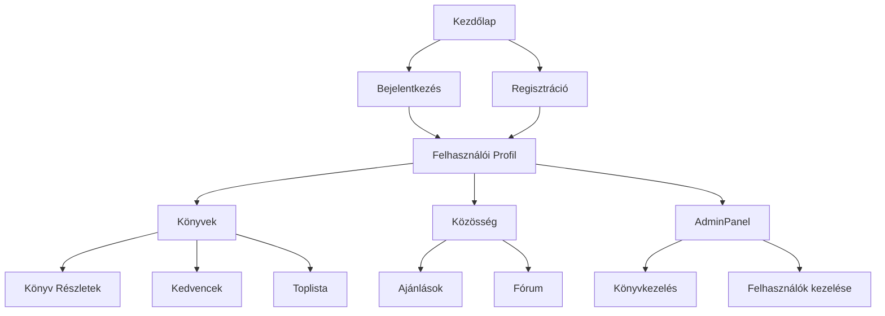
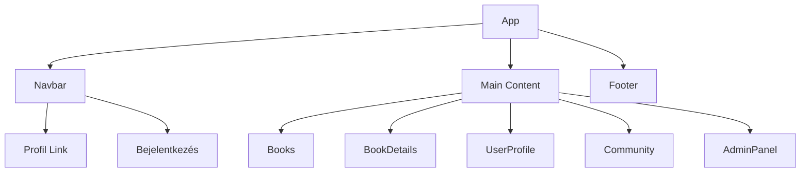

<div align="center">

<h1> BookBase </h1>

<hr>

Egy könyvtár kezelő adatbázissal, ahol lehet könyveket kezelni.

<br> <br>

</div>

<div style="page-break-before: always;"></div>

<div align="center">
<h1> „Schola Europa Akadémia” Technikum, Gimnázium és Alapfokú Művészeti Iskola a  Magyarországi Metodista Egyház fenntartásában </h1>

<br> <br>

**SZOFTVERFEJLESZTŐ ÉS -TESZTELŐ**<br>
5 0613 12 03

Dokumentáció

Készítette:<br>
Csontos Kincső <br>

**2025**

</div>

<div style="page-break-before: always;"></div>

<style>
body {
	 margin: 2cm;
}
</style>

# BookBase-Dev - Online Könyvplatform Dokumentáció

## Tartalomjegyzék

1. [Bevezetés](#1-bevezetés)
	- 1.1. [A Projekt Célja](#11-a-projekt-célja)
	- 1.2. [Főbb Funkciók](#12-főbb-funkciók)
	- 1.3. [Technológiai Stack](#13-technológiai-stack)

2. [Rendszerarchitektúra](#2-rendszerarchitektúra)
	- 2.1. [Magas Szintű Architektúra](#21-magas-szintű-architektúra)
	- 2.2. [Komponensek](#22-komponensek)
	- 2.3. [Adatbázis Séma](#23-adatbázis-séma)

3. [Frontend Architektúra](#3-frontend-architektúra)
	- 3.1. [Komponens Hierarchia](#31-komponens-hierarchia)
	- 3.2. [Állapotkezelés](#32-állapotkezelés)
	- 3.3. [Routing](#33-routing)
	- 3.4. [UI/UX Design](#34-uiux-design)

4. [Backend Architektúra](#4-backend-architektúra)
	- 4.1. [API Réteg](#41-api-réteg)
	- 4.2. [Szolgáltatások](#42-szolgáltatások)
	- 4.3. [Adatbázis Kapcsolat](#43-adatbázis-kapcsolat)
	- 4.4. [Fájlkezelés](#44-fájlkezelés)

5. [Biztonság](#5-biztonság)
	- 5.1. [Autentikáció](#51-autentikáció)
	- 5.2. [Jogosultságkezelés (RBAC)](#52-jogosultságkezelés-rbac)

6. [Tesztelés](#6-tesztelés)
	- 6.1. [Manuális Tesztek](#62-manuális-tesztek)

7. [Deployment](#7-deployment)
	- 7.1. [Környezetek](#71-környezetek)
	- 7.2. [CI/CD Pipeline](#72-cicd-pipeline)
	- 7.3. [Monitoring](#73-monitoring)
	- 7.4. [Hibaelhárítás](#74-hibaelhárítás)

8. [API Dokumentáció](#8-api-dokumentáció)
	- 8.1. [Felhasználói Végpontok](#81-felhasználói-végpontok)
	- 8.2. [Könyv Végpontok](#82-könyv-végpontok)
	- 8.3. [Közösségi Végpontok](#83-közösségi-végpontok)
	- 8.4. [Fájl Végpontok](#84-fájl-végpontok)

9. [Felhasználói Dokumentáció](#9-felhasználói-dokumentáció)
	- 9.1. [Telepítési Útmutató](#91-telepítési-útmutató)
	- 9.2. [Használati Útmutató](#92-használati-útmutató)
	- 9.3. [Hibaelhárítási Útmutató](#93-hibaelhárítási-útmutató)

10. [Fejlesztői Dokumentáció](#10-fejlesztői-dokumentáció)
	 - 10.1. [Fejlesztői Környezet Beállítása](#101-fejlesztői-környezet-beállítása)
	 - 10.2. [Kódolási Konvenciók](#102-kódolási-konvenciók)
	 - 10.3. [Verziókezelési Stratégia](#103-verziókezelési-stratégia)

11. [Jövőbeli Tervek](#11-jövőbeli-tervek)
	 - 11.1. [AI Segítő Rendszer](#111-ai-segítő-rendszer)
	 - 11.2. [Pontrendszer és Versenyek](#112-pontrendszer-és-versenyek)
	 - 11.3. [Chat Alkalmazás](#113-chat-alkalmazás)
	 - 11.4. [Képernyő Megosztás és Whiteboard](#114-képernyő-megosztás-és-whiteboard)
	 - 11.5. [Implementációs Terv](#115-implementációs-terv)

12. [Licensz](#12-licensz)

---

## 1. Bevezetés

### 1.1. A Projekt Célja

A BookBase-Dev egy modern, felhasználóbarát online könyvplatform, amely lehetővé teszi a felhasználók számára könyvek böngészését, értékelését, közösségi interakciókat, valamint saját profiljuk kezelését. A cél, hogy:

- Egyszerű, intuitív felületet biztosítson könyvgyűjtéshez, olvasáshoz, ajánlásokhoz
- Közösségi funkciókat nyújtson (vélemények, kedvencek, toplisták)
- Biztonságos és megbízható adatkezelést biztosítson
- Rugalmasan bővíthető legyen új funkciókkal

### 1.2. Főbb Funkciók

- Könyvek böngészése, részletek megtekintése
- Felhasználói regisztráció, bejelentkezés, profilkezelés
- Könyvek értékelése, kedvencek, toplisták
- Közösségi funkciók: fórum, ajánlások, aktivitás
- Admin felület (könyvkezelés, felhasználók kezelése)
- Fájlkezelés (borítókép, dokumentumok)

### 1.3. Technológiai Stack

#### Frontend
- React 
- React Router
- Tailwind CSS
- JavaScript

#### Backend
- PHP 
- REST API
- MySQL

#### Infrastruktúra
- XAMPP (Apache, MySQL, PHP)
- Windows 10/11 fejlesztői környezet

#### Hardverek

- Videókártya (GPU): NVIDIA RTX 3050 6gb Laptop GPU
- Processzor (CPU): AMD Ryzen 5 7235HS
- RAM: 16GB DDR5 4800 MHz

---

## 2. Rendszerarchitektúra

### 2.1. Magas Szintű Architektúra



### 2.2. Komponensek

#### Frontend
- `App.js`: fő alkalmazás, routing
- `Navbar.js`: navigációs sáv, profil elérés
- `Books.js`, `BookDetails.js`: könyvlista, részletek
- `UserProfile.js`: profil megtekintése/szerkesztése
- `Community.js`: közösségi funkciók
- `AdminPanel.js`: admin felület

#### Backend
- `index.php`: fő API belépési pont
- `login.php`, `reg.php`, `logout.php`: autentikáció
- `bookdetails.php`, `randombooks.php`, `top20list.php`: könyv API-k
- `userprofile.php`, `edit_email.php`, `reset_password.php`: profil API-k
- `community.php`: közösségi API
- `db/db.php`: adatbázis kapcsolat

### 2.3. Adatbázis Séma

Az adatbázis MySQL alapú, főbb táblák:

```sql
CREATE TABLE users (
  id INT PRIMARY KEY AUTO_INCREMENT,
  username VARCHAR(50) UNIQUE,
  email VARCHAR(100) UNIQUE,
  password VARCHAR(255),
  firstname VARCHAR(50),
  lastname VARCHAR(50),
  birthdate DATE,
  gender VARCHAR(10),
  registration_date DATETIME,
  admin TINYINT(1) DEFAULT 0
);

CREATE TABLE books (
  id INT PRIMARY KEY AUTO_INCREMENT,
  title VARCHAR(255),
  author VARCHAR(255),
  description TEXT,
  cover VARCHAR(255),
  published DATE
);

CREATE TABLE favorites (
  user_id INT,
  book_id INT,
  PRIMARY KEY(user_id, book_id)
);

CREATE TABLE recently_read (
  user_id INT,
  book_id INT,
  read_date DATE
);
```

Kapcsolatok:
- Egy user több könyvet olvashat/kedvelhet
- Könyvekhez borítókép, leírás, szerző tartozik

---

## 3. Frontend Architektúra

### 3.1. Komponens Hierarchia



### 3.2. Állapotkezelés

- React useState, useEffect
- Szerver oldali adatok lekérése fetch API-val
- Felhasználói azonosító cookie-ból (`getCookie('id')`)

### 3.3. Routing

- React Router: `/`, `/books`, `/book/:id`, `/user/:id`, `/community`, `/admin`
- Dinamikus útvonalak: profil, könyv részletek

### 3.4. UI/UX Design

- Tailwind CSS: modern, reszponzív design
- Komponens alapú felépítés
- Sötét/világos mód támogatás
- Felhasználóbarát formok, visszajelzések

---

## 4. Backend Architektúra

### 4.1. API Réteg

- REST API PHP-ban
- Minden végpont külön fájlban (pl. `bookdetails.php`, `userprofile.php`)
- JSON válaszok

### 4.2. Szolgáltatások

- Könyvkezelés: listázás, részletek, toplisták
- Felhasználókezelés: regisztráció, bejelentkezés, profil módosítás
- Közösségi funkciók: fórum, ajánlások
- Admin funkciók: könyv és user CRUD

### 4.3. Adatbázis Kapcsolat

- `db/db.php`: PDO alapú MySQL kapcsolat
- Biztonságos lekérdezések, prepared statement

### 4.4. Fájlkezelés

- Könyv borítókép feltöltés, profilkép
- Fájlok a szerveren, elérési út mentése adatbázisban

---

## 5. Biztonság

### 5.1. Autentikáció

- Regisztráció, bejelentkezés, jelszó reset
- Session/cookie alapú azonosítás
- Jelszavak hash-elése (password_hash)

### 5.2. Jogosultságkezelés (RBAC)

- Admin jogkör: adminpanel elérés, CRUD
- User jogkör: saját profil, könyvek, közösség
- Jogosultságok ellenőrzése backend oldalon


## 6. Tesztelés

### 6.1. Manuális Tesztek

- Felhasználói folyamatok tesztelése: regisztráció, bejelentkezés, profil módosítás, könyv böngészés
- Admin funkciók tesztelése

## 7. Deployment

### 7.1. Környezetek

- Fejlesztői: XAMPP, lokális gépen
- Tesztelési: staging szerver
- Produkciós: éles szerver

### 7.2. CI/CD Pipeline

- Git verziókezelés
- Automatikus tesztelés, build
- Deployment script (pl. FTP, rsync)

### 7.3. Monitoring

- Szerver logok, hibák figyelése
- Felhasználói visszajelzések

### 7.4. Hibaelhárítás

- Tipikus hibák: adatbázis kapcsolat, bejelentkezés, fájl feltöltés
- Logok, böngésző konzol, szerver naplók


## 8. API Dokumentáció

### 8.1. Felhasználói Végpontok

| Végpont | Metódus | Leírás |
|---------|---------|---------|
| `/backend/login.php` | POST | Bejelentkezés |
| `/backend/reg.php` | POST | Regisztráció |
| `/backend/userprofile.php` | GET | Profil lekérdezés |
| `/backend/userprofile.php` | POST | Profil módosítás |

### 8.2. Könyv Végpontok

| Végpont | Metódus | Leírás |
|---------|---------|---------|
| `/backend/bookdetails.php` | GET | Könyv részletek |
| `/backend/randombooks.php` | GET | Véletlen könyvek |
| `/backend/top20list.php` | GET | Toplista |

### 8.3. Közösségi Végpontok

| Végpont | Metódus | Leírás |
|---------|---------|---------|
| `/backend/community.php` | GET/POST | Fórum, ajánlások |

### 8.4. Fájl Végpontok

| Végpont | Metódus | Leírás |
|---------|---------|---------|
| `/backend/bookdetails.php?action=uploadCover` | POST | Borítókép feltöltés |


## 9. Felhasználói Dokumentáció

### 9.1. Telepítési Útmutató

1. XAMPP telepítése (Apache, MySQL, PHP)
2. Projekt mappák bemásolása (`backend`, `frontend`)
3. Adatbázis importálása (`backend/db/db.sql`)
4. Szükséges csomagok telepítése frontendhez:
	```bash
	cd frontend
	npm install
	```
5. Szerver indítása, böngészőben elérés: `http://localhost/BookBase-Dev/`

### 9.2. Használati Útmutató

1. Regisztráció, bejelentkezés
2. Könyvek böngészése, részletek megtekintése
3. Profil megtekintése, szerkesztése
4. Kedvencek, toplisták kezelése
5. Közösségi funkciók használata

### 9.3. Hibaelhárítási Útmutató

- Adatbázis kapcsolat hibák: ellenőrizze a `db.php` beállításait
- Fájl feltöltési hibák: fájlméret, típus ellenőrzése
- Bejelentkezési problémák: jelszó helyessége, email formátum


## 10. Fejlesztői Dokumentáció

### 10.1. Fejlesztői Környezet Beállítása

1. XAMPP telepítése
2. Frontend csomagok telepítése (`npm install`)
3. Adatbázis importálása
4. Szükséges környezeti változók beállítása (pl. adatbázis elérés)

### 10.2. Kódolási Konvenciók

- PHP: 4 szóköz, OOP, biztonságos lekérdezések
- JS/React: funkcionális komponensek, Tailwind, prop validáció
- Kommentek minden főbb függvényhez

### 10.3. Verziókezelési Stratégia

- Git használata
- Feature branch workflow
- Pull request, code review


## 11. Jövőbeli Tervek

### 11.1. AI Segítő Rendszer
- Könyvajánló algoritmus, olvasási szokások alapján
- Gépi tanulás segítségével személyre szabott könyvlisták
- Felhasználói értékelések, olvasási előzmények elemzése
- Ajánlások folyamatos finomhangolása visszajelzések alapján

### 11.2. Pontrendszer és Versenyek
- Aktivitás alapú pontgyűjtés, toplisták
- Pontokat lehet szerezni olvasásért, értékelésért, hozzászólásért
- Havi/éves versenyek, jutalmak a legaktívabb felhasználóknak
- Ranglisták, badge-ek, motivációs elemek

### 11.3. Chat Alkalmazás
- Közösségi chat, privát üzenetek
- Tematikus szobák (pl. fantasy, sci-fi, klasszikusok)
- Moderációs funkciók, spam szűrés
- Fájl- és linkmegosztás lehetősége

### 11.4. Képernyő Megosztás és Whiteboard
- Közös olvasás, jegyzetelés
- Valós idejű képernyőmegosztás tanulócsoportoknak
- Interaktív whiteboard, közös jegyzetek, rajzolás
- Tanári/tutor funkciók, csoportos feladatok

### 11.5. Implementációs Terv
- Folyamatos fejlesztés, felhasználói visszajelzések alapján
- Új funkciók bevezetése iteratív módon
- Béta tesztelés, pilot csoportok
- Dokumentáció és oktatóanyagok frissítése minden nagyobb verzióváltásnál


## 12. Licensz

Ez a projekt saját projektmunkás licensz alatt áll. A forráskód és a dokumentáció kizárólag oktatási célokra használható fel, kereskedelmi felhasználása nem engedélyezett.

A felhasználók vállalják, hogy nem töltenek fel jogvédett tartalmat.